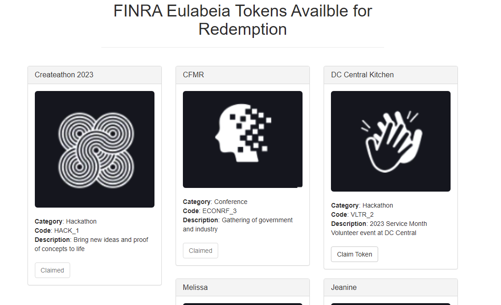

# Readme

This used the Pet-Shop Truffle box as an example https://trufflesuite.com/guides/pet-shop/

## Prereqs:
* Ganache (local chain) running
* install node package manager (`npm`)
* install truffle (`npm install -g truffle`)
* install Metamask
* import a wallet generated by your Ganache (Add new token matching your Ganache RPC info, import wallet via secret key)

## Running
1. Compile the contracts `truffle compile`
2. Migrate the contracts `truffle migrate`
3. Run server (dev mode) `npm run dev`

## Setup for Ganache
* NetworkID: 5777
* RPC Host: http://127.0.0.1:7576

Current state:

